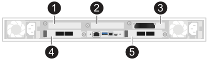

= Requisitos para el cableado de los nodos Data Compute para AI Data Engine
:allow-uri-read: 
:icons: font
:imagesdir: ../media/

[role="lead"]
Los Data Compute Node se integran con tu sistema de almacenamiento AFX 1K a través de conexiones de red de host y de red de clúster. Revisa la configuración de las ranuras de E/S, los tipos de cable y los requisitos de conexión para tu implementación.

NetApp-provided data compute nodes se conectan a los mismos switches de clúster que los nodos controladores AFX 1K, ampliando tu sistema de almacenamiento con recursos de cómputo optimizados para cargas de trabajo de IA y aprendizaje automático.

La configuración inicial de AI Data Engine (AIDE) admite un mínimo de tres nodos de cálculo de datos.

[cols="1,4"]
|===

 a| 
image::../media/icon_round_1.png[Aviso número 1]
 a| 
Ranura no utilizada en el Data Compute Node.

 a| 
image::../media/icon_round_2.png[Aviso número 2]
 a| 
Ranura no utilizada en el Data Compute Node.

 a| 
image::../media/icon_round_3.png[Aviso número 3]
 a| 
Ranura de GPU en el Data Compute Node.

 a| 
image::../media/icon_round_4.png[Llamada número 4]
 a| 
Ranura de E/S en el Data Compute Node.

 a| 
image::../media/icon_round_5.png[Llamada número 5]
 a| 
Ranura de E/S en el Data Compute Node.

|===

== NetApp-provided configuración de ranuras de E/S de nodos de cómputo de datos

El Data Compute Node utiliza un esquema de numeración de ranuras específico que difiere de las configuraciones de servidor estándar. Entender la disposición de las ranuras es esencial para un cableado adecuado.

* *Ranura 3*: Reservada para GPU (no accesible para cableado de I/O)
* *Ranuras 4 y 5*: ranuras de E/S utilizadas para conexiones de red
+
** Puerto a: conexiones de red del clúster
** Puerto b: conexiones de red host

* *Ranuras 1 y 2*: despobladas e inaccesibles para su uso

== NetApp-conexiones de red de nodos de cómputo de datos proporcionadas

Los Data Compute Node requieren dos tipos de conexiones de red para integrarse con el sistema de almacenamiento AFX 1K.

* *Conexiones de red de host*
+
Las conexiones de red del host proporcionan acceso a los datos del cliente y permiten que los data compute nodes procesen cargas de trabajo. Cada data compute node utiliza los puertos e4b y e5b para conexiones redundantes a switches de red de host independientes.

+
Asignaciones de puertos:

+
** e4b: se conecta al switch de red A del host
** e5b: se conecta al switch de red B del host

* *Conexiones de red del clúster*
+
Las conexiones de red del clúster permiten la comunicación entre los nodos de cálculo de datos y los nodos controladores AFX 1K dentro del clúster de almacenamiento. Cada nodo de cálculo de datos utiliza los puertos e4a y e5a para conexiones redundantes a switches de red de clúster independientes.

+
Asignaciones de puertos:

+
** e4a: se conecta al switch de red A del cluster
** e5a: se conecta al switch de red B del cluster

== Componentes de hardware compatibles

NetApp-los nodos de cómputo de datos suministrados requieren cables y switches específicos para garantizar una conectividad y un rendimiento adecuados con el sistema de almacenamiento AFX 1K.

[cols="2,3,6"]
|===
| *Nodo de cálculo* | *Conmutadores compatibles* | *Cables compatibles* 

 a| 
NetApp-nodos de cómputo de datos proporcionados (se requieren un mínimo de tres)
 a| 
* Cisco Nexus 9332D-GX2B (400GbE)
* Cisco Nexus 9364D-GX2A (400GbE)

 a| 
* 400GbE QSFP-DD breakout a cables 4x100GbE QSFP56 para conexiones a Data Compute Node:
+
** 100GbE a puertos de red del clúster Data Compute Node (e4a, e5a)
** 100GbE a puertos de red de host de Data Compute Node (e4b, e5b)

* Cables RJ-45 para conexiones de gestión

NOTE: Los cables multiconectores proporcionan cuatro conexiones de 100GbE desde cada puerto del switch de 400GbE. Conecta el extremo de 400GbE a los switches y el extremo de 100GbE a los puertos de E/S del Data Compute Node.

|===

== Orientación del cable

Al conectar cables a los nodos de cálculo, una orientación adecuada garantiza conexiones fiables.

Los gráficos de cableado de los procedimientos de instalación muestran iconos de flechas que indican la orientación correcta (hacia arriba o hacia abajo) de la lengüeta del conector del cable al insertar un conector en un puerto. Al insertar el conector, deberías sentir que encaja en su sitio. Si no sientes que encaja, sácalo, dale la vuelta e inténtalo de nuevo.

image:../media/drw_cable_pull_tab_direction_ieops-1699.svg["Dirección de la lengüeta de tracción del cable"]

CAUTION: Manipula con cuidado los delicados componentes del conector al hacer clic para colocarlos en su sitio.

.¿Qué sigue?
Después de revisar la configuración del cableado, link:cable-hardware.html["cablea el hardware de tus nodos de cálculo de datos"].
