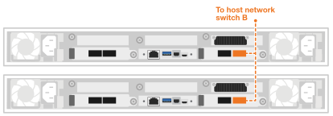

= Conecta tus nodos de Data Compute Node para AI Data Engine
:allow-uri-read: 
:icons: font
:imagesdir: ../media/

[role="lead"]
Conecta tus nodos de Data Compute Node a la red del host y a los switches de red del clúster para permitir el procesamiento de cargas de trabajo de IA y la integración con tu sistema de almacenamiento AFX 1K. Este procedimiento usa conexiones 100GbE tanto para el acceso a la red del host como para la comunicación del clúster, permitiendo que los nodos aprovechen la infraestructura de clúster existente sin apagar el sistema AFX.

.Acerca de esta tarea
Estos procedimientos muestran configuraciones comunes. El cableado específico depende de los componentes pedidos para tu sistema de almacenamiento. Para obtener información detallada sobre la configuración y las prioridades de las ranuras, consulta link:https://hwu.netapp.com["NetApp Hardware Universe"^].

NOTE: No necesitas apagar el sistema de almacenamiento AFX 1K cuando estés cableando los nodos de cálculo de datos. Puedes agregar los nodos de cálculo de datos a un sistema de almacenamiento AFX 1K existente que ya esté encendido y configurado.

.Antes de empezar
* Ya tienes instalado un sistema de almacenamiento AFX 1K. Para información sobre cómo instalar el sistema de almacenamiento AFX 1K, consulta link:https://docs.netapp.com/us-en/ontap-afx/install-setup/install-setup-workflow.html["Documentación de instalación del sistema de almacenamiento AFX 1K"^].
* Tienes instalados y configurados los switches de red necesarios. Habla con tu administrador de red para saber cómo conectar el sistema a tus switches de red.
* Has revisado la link:../install-setup/cable-overview.html["requisitos de cableado para los Data Compute Node"].

NOTE: Se necesita un mínimo de tres nodos de cómputo de datos para desplegar el AI Data Engine.

== Paso 1: conecta los Data Compute Node a la red host

Puedes conectar los puertos del Data Compute Node a tu red host.

.Pasos
. Conecta el puerto e4b de los siguientes Data Compute Node al switch de red de datos Ethernet A:
+
** Data Compute Node 1, puerto e4b
** Data Compute Node 2, puerto e4b
+
*cables 100GbE*

+
image::../media/oie_cable100_gbe_qsfp28.png[cable Ethernet de 100 Gb]

+
image::../media/drw_aide_network_cabling_a_ieops_2647.svg[Cable a red Ethernet]

. Conecta el puerto e5b de los siguientes Data Compute Node al switch de red de datos Ethernet B:
+
** Data Compute Node 1, puerto e5b
** Data Compute Node 2, puerto e5b
+
*cables 100GbE*

+
image::../media/oie_cable100_gbe_qsfp28.png[cable Ethernet de 100 Gb]

+

== Paso 2: conecta los cables del clúster de Data Compute Node

Para los nodos de cómputo de datos, usa cables breakout 4x100GbE para conectar los puertos e4a/e5a para las conexiones del clúster.

.Pasos
. Conecta el puerto e4a de los siguientes nodos de Data Compute Node a un puerto que no sea ISL en el switch de red del clúster A:
+
** Data Compute Node 1, puerto e4a
** Data Compute Node 2, puerto e4a
+
*4x100GbE cables multiconector*

+
image::../media/oie_cable100_gbe_qsfp28.png[cable Ethernet de 100 Gb]

+
image::../media/drw_aide_switched_cluster_cabling_a_ieops-2649.svg[Cable a red Ethernet]

. Conecta el puerto e5a de los siguientes Data Compute Node a un puerto que no sea ISL en el switch de red B del clúster:
+
** Data Compute Node 1, puerto e5a
** Data Compute Node 2, puerto e5a
+
*4x100GbE cables multiconector*

+
image::../media/oie_cable100_gbe_qsfp28.png[cable Ethernet de 100 Gb]

+
image::../media/drw_aide_switched_cluster_cabling_b_ieops-2650.svg[Cable a red Ethernet]

.¿Qué sigue?
Después de que hayas cableado el hardware, link:power-on-hardware.html["enciende tus Data Compute Node"].
